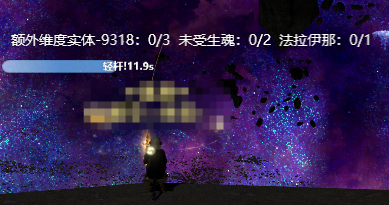
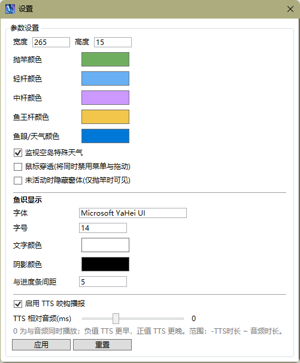

# 渔人的直感



渔人的直感是一个适用于《最终幻想14》国服的钓鱼辅助工具，提供抛竿计时、咬钩提示、鱼眼与特殊天气倒计时，以及鱼识前置进度追踪等功能。

**仅支持国服 64 位 DX11 客户端，不支持国际服（鱼识没有配置，可以自己更换FishKnowledge.json后使用）。** 需要使用管理员权限启动。

## 主要特性

- 支持国服最新版本游戏客户端，内存偏移自动获取。
- 抛竿计时与咬钩杆种提示（轻杆 / 中杆 / 鱼王杆）。
- 10 秒内短杆计时条速度为通常的 3 倍，方便在幻海流等情况下提升不同鱼种区分度。
- 支持幻海流与空岛特殊天气计时，特殊天气触发时自动开始倒计时。
- **鱼识追踪**：在已知钓场自动显示鱼王前置鱼种进度，获得鱼识 Buff 后同步显示剩余时间。
- **TTS 咬钩播报**：可选用 Windows 语音合成播报杆型，并可调节与提示音的播放时机。
- 支持自定义界面长度与宽度、计时条颜色与各杆种咬钩颜色。
- 支持自定义咬钩提示音效（也可不使用提示声音）。
- 支持自定义鱼识文字样式（字体、字号、颜色、阴影、与进度条间距）。
- 托盘图标，可右键呼出设置与退出。
- 窗体默认从任务栏与 Alt+Tab 中隐藏，支持鼠标穿透。
- 可设置未活动时隐藏窗体；空岛特殊天气计时可单独开关。

### 1.4 更新内容

- 新增**鱼识**功能：根据聊天日志与内存 Buff 追踪钓场前置进度与鱼识倒计时。
- 新增 **TTS 咬钩播报**，支持调节 TTS 相对提示音的播放时机。
- 内置 `Data/FishKnowledge.json` 鱼识数据，覆盖常见鱼王钓场。
- 提示音效支持放在程序目录或 `Wav` 子目录。

感谢 [@PrototypeSeiren](https://github.com/PrototypeSeiren) 大佬的技术支持！

## 使用方法

启动渔人的直感后，软件将处于半透明的悬浮状态，可拖动位置。右键点击计时条可开启设置或跳转钓鱼时钟；开启鼠标穿透后，需通过托盘图标右键呼出菜单。

### 抛竿计时

抛竿后，计时条开始计时。有鱼咬钩时停止计时，并在计时条上显示咬钩杆种。

<details>
<summary>咬钩时的提示样式</summary>


</details>

计时条颜色会随杆种改变，可在设置中自定义各杆种颜色。

在程序同目录或 `Wav` 子目录下放置 `轻杆.wav`、`中杆.wav`、`鱼王杆.wav`，对应杆种咬钩时会播放提示音效。压缩包中附带范例文件；不放或只放其中部分文件也不影响正常使用。

在设置中可开启 **TTS 咬钩播报**，使用 Windows 语音播报「轻竿」「中竿」「鱼王竿」。通过 **TTS 相对音频** 滑块可调节语音与提示音的先后关系：`0` 为同时播放，负值表示 TTS 更早，正值表示 TTS 更晚。

### 鱼眼与特殊天气提示

开启鱼眼后，主界面显示鱼眼持续时间倒计时。海钓中幻海流触发时显示幻海流倒计时（120s）。

幻海流持续时间不是固定值，区域倒计时 30 秒时会无视剩余时间强制解除幻海流，需要注意。中途加入已处于特殊天气的云冠群岛时，第一次剩余时间计时可能不同步，后续触发的特殊天气才会正常计时。

### 鱼识

在支持鱼识数据的钓场抛竿、发现或记录钓场后，计时条上方会显示该钓场的鱼王前置进度，格式为 `鱼名：当前数量/需要数量`。

- 通过读取游戏聊天日志统计已钓上的前置鱼种（需为本人钓鱼相关消息）。
- 获得鱼识 Buff 后，自动切换为 `鱼识：剩余秒数` 倒计时，与游戏内 Buff 时间同步。
- 钓上鱼王后，前置进度会重置；收竿或切换地图/海域后，鱼识显示会清空或隐藏。
- 若钓场名称不在 `FishKnowledge.json` 中，则不会显示鱼识信息。

鱼识文字的字体、字号、颜色、阴影及与进度条的间距，均可在设置的「鱼识显示」区域调整。

### 自定义



#### 计时条样式

在设置菜单中可调整计时条的大小与颜色。查询颜色 Hex 值可使用在线取色器，如 [HTML 拾色器](https://www.w3cschool.cn/tools/index?name=cpicker)。


#### 主窗体隐藏

开启**鼠标穿透**后，计时条无法拖动或右键展开菜单，需通过托盘图标右键呼出设置。

开启**未活动时隐藏窗体**后，未抛竿且没有特殊天气/鱼识显示时，窗体将自动隐藏。

## 编译

需要 Visual Studio（含「.NET 桌面开发」工作负载）与 .NET Framework 4.8。在项目根目录执行：

```powershell
.\build-release.ps1
```

输出文件位于 `渔人的直感\bin\Release\渔人的直感.exe`。
